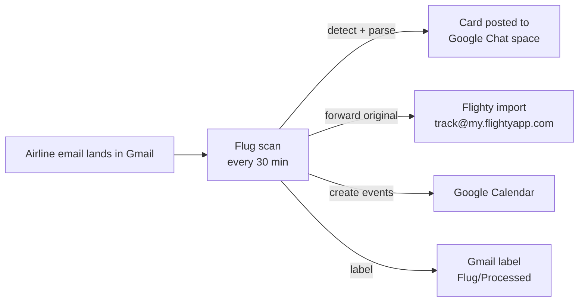

# Flug ✈️

Automated flight info organizer. A small Google Apps Script that runs inside
your own Google account, watches your Gmail for flight confirmation emails,
and then:

1. **Posts a card to a Google Chat space** with the airline, flight numbers,
   route, dates, confirmation code, and a link back to the email.
2. **Auto-forwards the original email to Flighty** (`track@my.flightyapp.com`)
   so the trip populates in the Flighty app automatically.
3. **Adds Google Calendar events** for each flight date — timed blocks when a
   departure time could be parsed, all-day events otherwise, optionally in a
   dedicated flights calendar.

No servers, no cost, no third party reading your mail — everything runs in
your Google account on a timer (every 30 minutes by default).



## How detection works

Each scan searches recent mail (4-day window by default) for messages from
~60 known airline / booking-site domains or with flight-y subjects
("flight confirmation", "e-ticket", "schedule change", …), then scores each
message on sender, subject, and body signals (record locator, flight-number
patterns, etc.) to filter out airline marketing mail. Every message is
processed exactly once (dedupe by message ID), and matched threads get a
`Flug/Processed` label in Gmail so you can see what was picked up.

Only high-confidence confirmations (recognized airline sender **and** a
parseable confirmation code or flight number) are forwarded to Flighty, so
Flighty doesn't ping you about emails it can't read. Schedule-change and
delay emails still get posted to Chat.

## Setup (~10 minutes)

### 1. Get a Google Chat webhook

1. In [Google Chat](https://chat.google.com), create (or open) the space you
   want flight info in.
2. Click the space name → **Apps & integrations** → **Webhooks** →
   **Add webhook**. Name it "Flug", save, and copy the webhook URL.

> Incoming webhooks require a Google Workspace account. On a personal
> `@gmail.com` account the Webhooks menu may not be available — in that case
> skip this step and just use the Flighty forwarding half (set
> `CHAT_WEBHOOK_URL` empty), or point the webhook at a space in your
> Workspace account.

### 2. Link your Gmail address in Flighty

In the Flighty app: **Settings → Import Flights → Email Forwarding** and make
sure the Gmail address this script runs under is linked/verified. The first
forward may trigger a validation email from Flighty — confirm it once and
you're set.

### 3. Create the Apps Script project

**Option A — copy/paste (no tools needed):**

1. Go to [script.new](https://script.new) (signed in as the Gmail account
   that receives your confirmations).
2. Create one file per file in [`src/`](src/) (`Config`, `Detect`, `Parse`,
   `Chat`, `Calendar`, `Main`) and paste the contents in.
3. Project Settings (⚙️) → check **Show "appsscript.json" manifest file** →
   replace its contents with [`src/appsscript.json`](src/appsscript.json)
   (adjust `timeZone` to yours).

**Option B — [clasp](https://github.com/google/clasp) (one command):**

From the repo root, on a machine with Node.js (this needs a browser to log
into *your* Google account, so it can't run in a remote sandbox):

```bash
npm install         # installs clasp locally
npx clasp login     # opens a browser — authorize with your Google account
./deploy.sh         # creates the Apps Script project (first run) and pushes src/
```

Later code changes: just re-run `./deploy.sh` (or `npm run push`).
`npm run open` opens the project in the editor; `npm run logs` tails execution logs.

### 4. Configure and start it

1. In the Apps Script editor, run **`setup`** once (pick it in the function
   dropdown → Run) and grant the permissions it asks for. This seeds the
   config, creates the Gmail label, and schedules the recurring scan.
2. Project Settings → **Script Properties** → paste your webhook URL into
   `CHAT_WEBHOOK_URL`.
3. Run **`sendTestMessage`** — you should see a hello message in your space.
4. (Optional) Run **`runFlightScan`** once to process the last few days
   immediately, or **`backfill`** to forward the last ~6 months of
   confirmations to Flighty (Chat stays quiet during backfill).

Done. New bookings will show up in the space and in Flighty within one scan
interval of the email arriving.

## Configuration

All settings live in **Project Settings → Script Properties** (defaults in
[`src/Config.js`](src/Config.js)):

| Property | Default | What it does |
|---|---|---|
| `CHAT_WEBHOOK_URL` | *(empty)* | Google Chat incoming-webhook URL. Empty = no Chat posts. |
| `FORWARD_TO_FLIGHTY` | `true` | Auto-forward confirmations to Flighty. |
| `FLIGHTY_ADDRESS` | `track@my.flightyapp.com` | Flighty's email-import address. |
| `ADD_TO_CALENDAR` | `true` | Create Google Calendar events for detected flights. |
| `CALENDAR_ID` | *(empty)* | Empty = your default calendar. Or a calendar ID (calendar settings → "Integrate calendar") to keep flights in their own calendar. |
| `FLIGHT_EVENT_HOURS` | `3` | Event length when a departure time was parsed (all-day event otherwise). |
| `SEARCH_WINDOW_DAYS` | `4` | Look-back window per scan (dedupe makes overlap harmless). |
| `SCAN_INTERVAL_MINUTES` | `30` | Scan frequency (1/5/10/15/30, or 60+ for hourly). Re-run `setup` after changing. |
| `EXTRA_SENDERS` | *(empty)* | Comma-separated extra sender domains (corporate travel tool, a missing airline, …). |

## Functions you can run manually

| Function | Purpose |
|---|---|
| `setup` | One-time install: config, label, recurring trigger. Re-run after changing the scan interval. |
| `dryRun` | **Test safely:** scan the last 90 days and log what would match and what was parsed — no Chat posts, no forwards, no events, nothing marked processed. |
| `runFlightScan` | Scan now (same thing the trigger runs). |
| `sendTestMessage` | Post a test message to the Chat space. |
| `backfill` | Forward the last 180 days of confirmations to Flighty, without Chat posts. Edit the default in `Main.js` for a different window. |
| `resetProcessedIds` | Forget which emails were already handled (for re-testing). |

## Notes & caveats

- **Flighty's stance on forwarding:** Flighty's help docs say emails should
  be forwarded manually, for privacy. This script automates that from *your
  own* account — nothing goes anywhere except your Chat space and Flighty.
  Emails Flighty can't parse trigger an in-app notification; Flug minimizes
  those by only forwarding high-confidence airline confirmations.
- **Gmail sending quota:** forwards count as outgoing mail (~100/day on
  consumer Gmail). Normal booking volume is nowhere near this; a huge
  `backfill` might be.
- **Parsing is best-effort** for the Chat card (airlines' email formats vary
  wildly). Flighty re-parses the original email itself, so the card being
  sparse doesn't affect the Flighty import.
- **Adding an airline Flug missed:** add its sender domain to
  `EXTRA_SENDERS` — no code change needed.
- **Calendar events are best-effort:** dates/times are parsed from the email
  text, and the departure timezone isn't always stated, so times use your
  script timezone. Google's own **"Events from Gmail"** setting (Calendar →
  Settings → Events from Gmail) does timezone-perfect flight events for major
  airlines — you can use it alongside or instead of Flug's calendar feature
  (set `ADD_TO_CALENDAR` to `false` to avoid doubles if both are on).
- **Re-authorizing after updates:** if you added the calendar feature to an
  existing install, update `appsscript.json` too (new `calendar` scope) and
  run `setup` again to re-grant permissions.
- **Schedule changes** are posted to Chat but don't move existing calendar
  events; duplicate events for re-sent confirmations are skipped by
  title+day matching.
